## プロキシの設定

自身のPCにプロキシが設定されている場合、別途設定が必要となります。  
※インターン当日はプロキシ設定が無い状態で行います。  

###自身の設定を確認する  
1. Internet Explorerを起動します。  
1. ツール > インターネットオプションを選択します。  
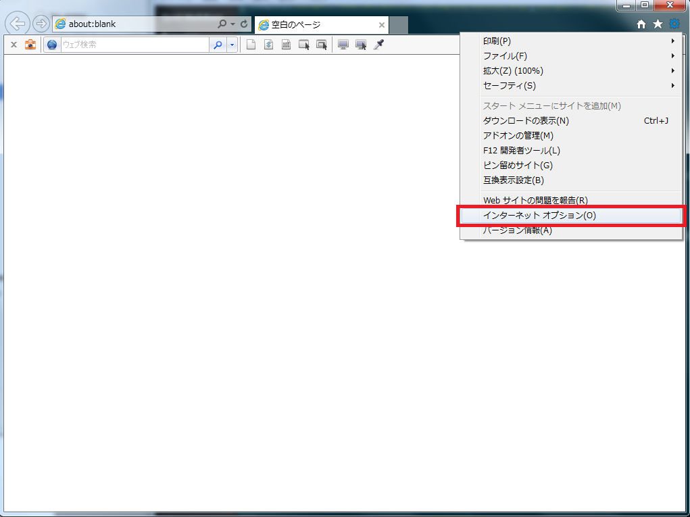  
  
1. インターネットオプションウィンドより、接続 > LANの設定を選択します。  
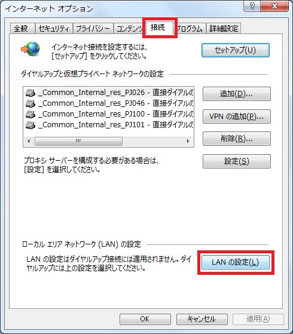

1. プロキシ サーバー内の「LANにプロキシサーバを使用する」にチェックがついていた場合、以降のプロキシの設定が必要となります。  
   記載されているアドレスとポートを控えておいてください。  
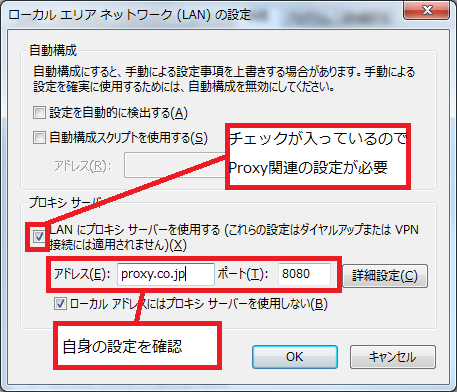  
---
###Mavenでのプロキシ設定  
Mavenのプロキシ設定は、下記ページの「手順.5」を参照してください。  
[【Apache Maven3 (3.2.5) インストール手順】](http://weblabo.oscasierra.net/install-maven-32-windows/)  

---
###IntelliJでのプロキシ設定  
1. IntelliJのWelcome画面(またはメニューバー>File)からSettingを選択します。  
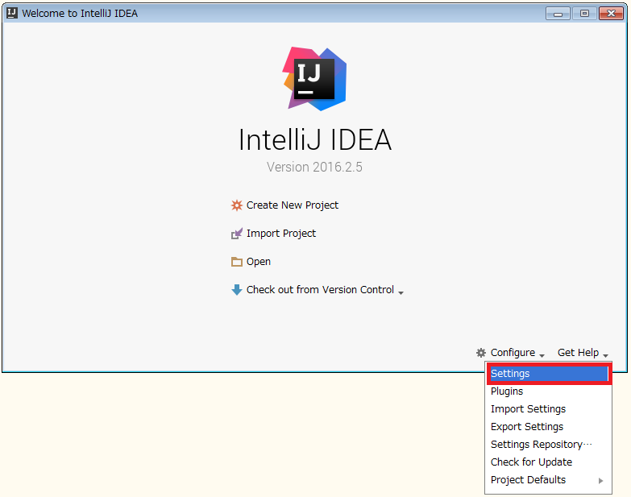  
  
1. Settingsウィンドウが表示されるので、左のバーからAppearance & Behavior > 一般 > HTTP Proxyを選択します。  

1. 「HTTPプロキシを使用する」を選択し、各自の設定を記載します。  

1. 下部OKボタンを押下します。  
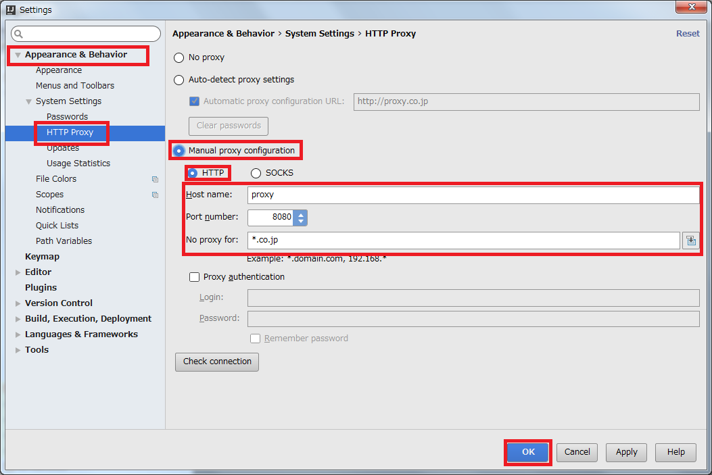  
---
###Heroku動作のためのプロキシ設定  
環境変数に自身のプロキシについて設定する必要があります。  
1. スタート > コンピューターを右クリック > プロパティ > システムの詳細設定を選択してください。  
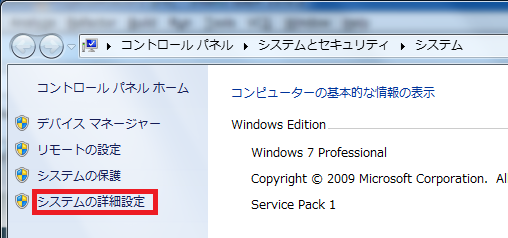  

1. システムのプロパティウィンドウの詳細設定 > 環境変数を選択します。  
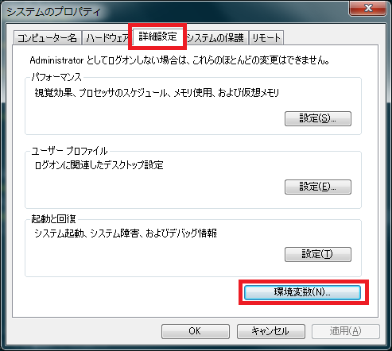  

1. ユーザー環境変数内の新規ボタンを押下してください  
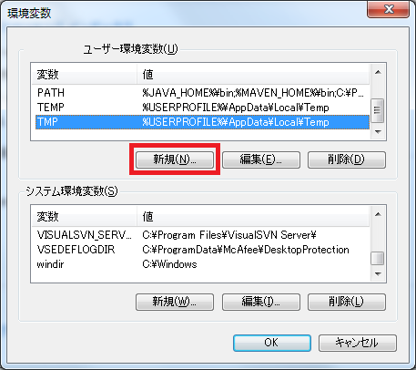  

1. 変数名に`HTTP_PROXY`、変数値に各自の設定を入力し、OKを選択します。  
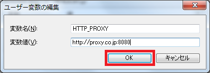  

1. 同様に変数名に`HTTPS_PROXY`、変数値に各自の設定を入力し、OKを選択します。  
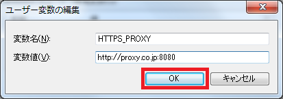  

1. 環境変数ウィンドウ内のOKボタンを押下してください。  
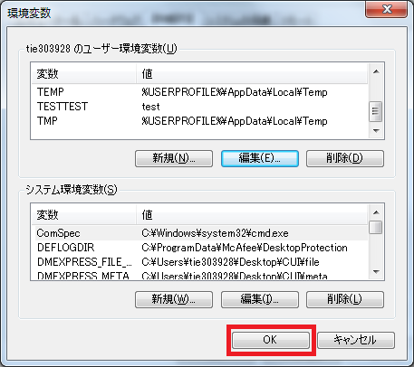  

1. スタート > すべてのプログラム > アクセサリ > コマンドプロンプトを選択してください。  

1. コマンドに`set`を入力し、先程入力した設定が反映されていることを確認してください。  
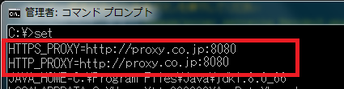  
