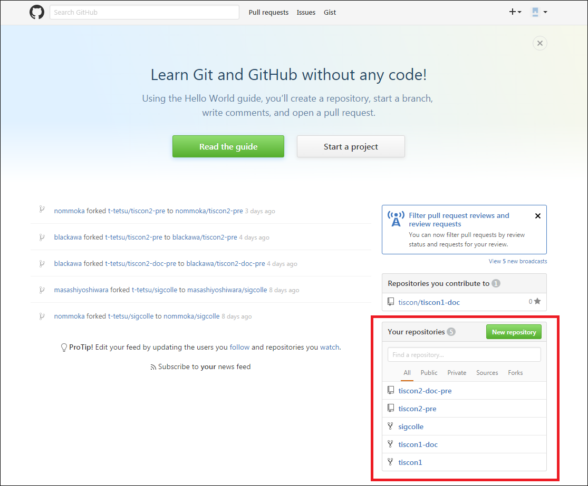

#QA一覧
***
・[mvnが正常に動作しない (mvn --versionコマンドが失敗する)](#path_setting)  
・[IntelliJでのプロジェクトのcloneができない](#project_clone)  
・[Make Projectでエラーが発生する](#sdk_setting)  

***
  
  
<a name ="path_setting">
##mvnが正常に動作しない (mvn --versionコマンドが失敗する)

　エラー例①  
　  
　エラー例②  
　  

JDKまたはMavenの環境変数設定が誤っている可能性があります。  
JDK,Mavenをインストールしたディレクトリと環境変数が一致しているかを確認してみてください。  
(環境変数に指定しているディレクトリが実際に存在しているか確認してください)

#####JDKの環境変数設定
1.システム環境変数『Path』  
　　例)C:\Program Files\Java\jdk1.8.0_111\bin  
2.システム環境変数『JAVA_HOME』  
　　例)C:\Program Files\Java\jdk1.8.0_111  
※ユーザー環境変数とシステム環境変数の両方に同じ変数名で値が設定されている場合、ユーザー環境変数の値が優先されてしまいます。ユーザー環境変数に『JAVA_HOME』が存在する場合、そちらは削除してください。  
  
【補足】環境変数『Path』だけはユーザー変数がシステム変数を上書きせず、両方の値が「;」で連結された設定となります。  
#####Mavenの環境変数設定
1.システム環境変数『Path』  
　　例)C:\Program Files\apache-maven-3.2.5\bin  
※環境構築手順に記載しているように、ダウンロードしたMavenは「C:\Program Files」に格納してください。そうした場合、Pathの変数値は上記例の通りになります。
  
  
<a name ="project_clone">
##IntelliJでのプロジェクトのcloneができない

下記の問題である可能性があります。確認してみてください。  
  
#####URLの入力誤り
　Git Repository URLに入力しているURLが正しいかを確認してください。  
　　※入力するURL:https://github.com/[Githubのユーザ名]/tiscon1.git
#####自身のGithubアカウントでのプロジェクトForkができていない
Githubにログインし、プロジェクトのforkができているかを確認してください。  
（下図のように、forkができているとリポジトリ一覧に「tiscon1」が表示されます。）  
forkできていなかった場合は、もう一度環境構築手順に従いプロジェクトのforkを行って下さい。  
　

#####Heroku内のGitインストールが完了していない
　コマンドプロンプトで「git --version」と入力し、gitのバージョン情報が表示されるか確認してください。  
　表示されない場合、Gitのインストールに失敗しています。heroku toolbeltのインストールを再実施して下さい。  
  
  
<a name ="sdk_setting">
##Make Projectでエラーが発生する

　エラー例①  
　  

Make Projectボタンを押下した時に上図のエラーが表示される場合、プロジェクトに対してSDKが設定されていないことが原因であると考えられます。  
下記手順に従って、SDKの設定を行って下さい。  
  
1．[Project Structure]>[Project Settings]>[Project]から、「Project SDK」に環境構築でインストールしたJDKを設定する。  
　  
　  
　  
  
2．「Project language level」に『8 - Lambdas, type annotations etc.』を設定し、「OK」ボタンを押下する。  
　  

<a name ="plugin_waitt">
##waitt:runが存在しない
