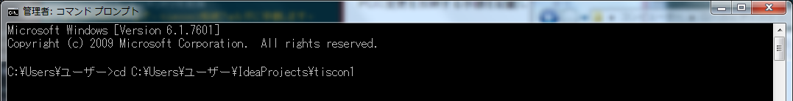
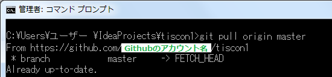
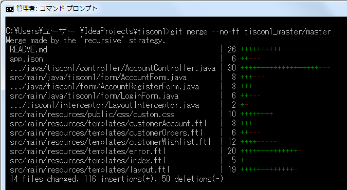
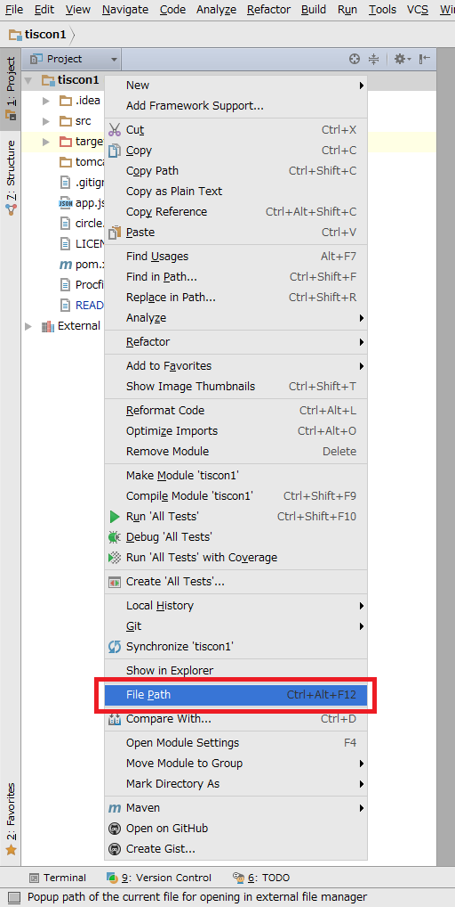
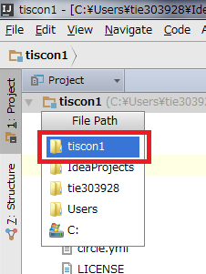
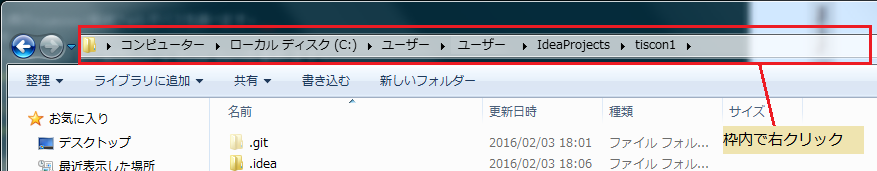
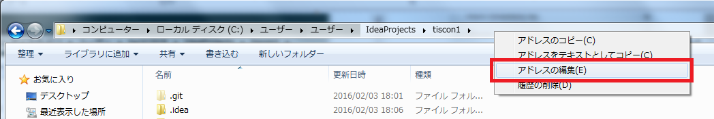
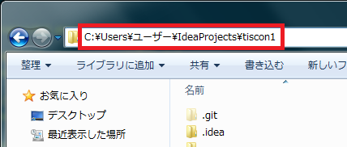

# 更新手引き

本ガイドはGithub上のtiscon2に更新があった場合に、自身のPCに変更を反映する手順を記載しています。  

1. tiscon1格納フォルダへ移動  
コマンドプロンプト上で、`cd [tiscon1格納フォルダ]`を実行してください。  

※コマンドプロンプトの起動方法は本ガイドの「参考-コマンドプロンプトの起動方法」を参照してください。  
※tiscon1格納フォルダは、本ガイドの「参考-tiscon1格納フォルダパスの確認」を参照してください。  
※コマンドプロンプト上にコピーした文字列を張り付ける場合、右クリック > 貼り付け を選択してください。  

1．リモートリポジトリの追加
https://github.com/tiscon/tiscon1をリモートリポジトリとして登録します。  
`git remote add tiscon1_master https://github.com/tiscon/tiscon1.git`を実行してください。  
`git remote -v`を実行し、「tiscon1_master」があることを確認します。  

1. user.nameの確認
`git config -l`を実行します。  
表示された設定値一覧内に「user.name」と「user.email」があり、設定されていることを確認します。  
※設定されていなかった場合、以下のコマンドを実行してください。  
`git config --global user.name Githubのアカウント名`  
`git config --global user.email emailアドレス`  

1. fetch  
tiscon1_master から最新の状態を取得します。  
`git fetch tiscon1_master`を実行してください。  
`git branch -a`を実行し、「remotes/tiscon1_master/master」があることを確認してください。

1. マージされるブランチの最新化  
forkしたリポジトリを最新化します。  
`git pull origin master`を実行してください。  

1. merge  
forkしたリポジトリにfork元のリポジトリをマージします。  
`git merge --no-ff tiscon1_master/master`を実行してください。  

1. Githubの最新化  
最新化したローカルの状態を自身のGithubに反映します。  
`git push origin master`を実行してください。  
※ユーザ名とパスワードは自身のGithubのアカウント情報を入力してください。  
この作業終了後、Githubのマイページが最新化されていることが確認できます。  
https://github.com/Githubのアカウント名/tiscon1

1. 最新状態での動作確認  
環境構築手順内の「ローカルでの稼働確認」を行い、更新が反映されていることを確認してください。  
[【環境構築手順書】](https://github.com/tiscon/tiscon1-doc/)

## 参考

### コマンドプロンプトの起動方法

スタート > すべてのプログラム > アクセサリ > コマンドプロンプトを選択してください。

### tiscon1格納フォルダパスの確認

Githubからcloneしてきた際のtiscon1格納フォルダパスを調べます。  

1. IntelliJを起動します。  

1. Project View > 「tiscon1」上で右クリック > File Pathを選択します。  
  

1. tiscon1を選択します。  
  

1. tiscon1の格納フォルダが開きます。さらにtiscon1を選択します。  

1. 上部のボックス上で右クリック > アドレスの編集を選択すると、tiscon1の格納フォルダパスが表示されます。  
画像例では`C:\Users\ユーザー\IdeaProjects\tiscon1`がtiscon1の格納フォルダパスです。  
 
 

